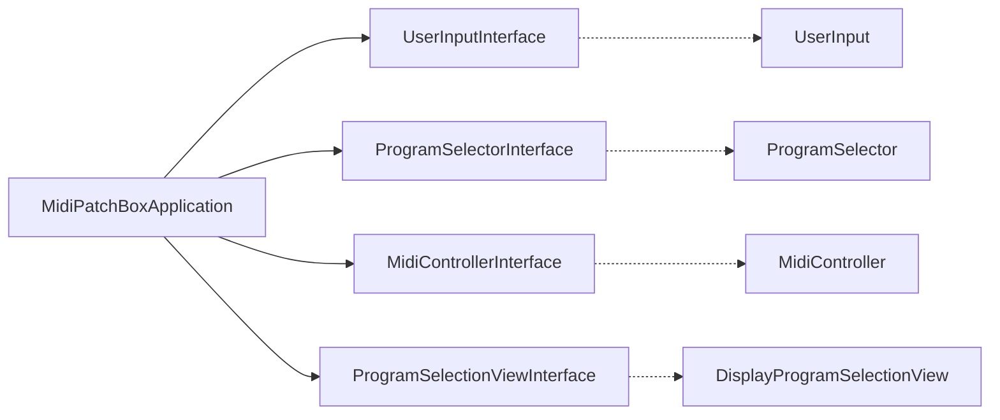
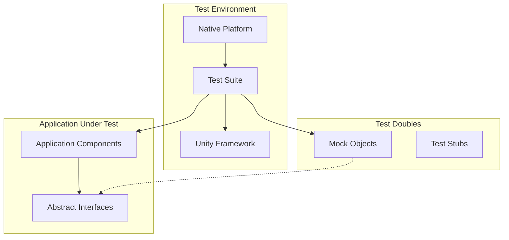

# Architecture

## Overview

MIDI Patch Box is a programmable MIDI controller built on the RP2040 microcontroller platform. The project implements a clean, modular architecture with strict separation of concerns, enabling reliable MIDI program selection through hardware buttons and rotary encoder input.

The architecture follows modern C++ design principles with interface-based abstraction, dependency injection, and comprehensive unit testing using the Test-Driven Development (TDD) approach.

## Architectural Principles

### Core Design Principles

- **Interface Segregation**: Each interface defines a single, focused responsibility
- **Dependency Inversion**: Application layer depends on abstractions, not concrete implementations
- **Single Responsibility**: Each class has one clear purpose and reason to change
- **Test-Driven Development**: Business logic is developed test-first with comprehensive coverage
- **Fluent Interface**: Method chaining for intuitive configuration (`setUserInput()->setProgramSelector()`)

### Key Architectural Decisions

1. **Layered Architecture**: Clear separation between application logic, hardware drivers, and testing
2. **Interface-Based Design**: All cross-layer communication happens through abstract interfaces
3. **Dependency Injection**: Components receive their dependencies through setter methods
4. **Mock-Based Testing**: Hardware dependencies are mocked for isolated unit testing

## System Architecture

```mermaid
graph TB
    subgraph "Application Layer (src/app/)"
        APP[MidiPatchBoxApplication]
        PS[ProgramSelector]
        BTN[Button]
        UI[UserInput]
        
        subgraph "Interfaces"
            UII[UserInputInterface]
            PSI[ProgramSelectorInterface]
            MCI[MidiControllerInterface]
            IOI[IoDriverInterface]
            PSVI[ProgramSelectionViewInterface]
        end
    end
    
    subgraph "Hardware Layer (src/hardware/)"
        MC[MidiController]
        AIO[ArduinoIoDriver]
        DPSV[DisplayProgramSelectionView]
    end
    
    subgraph "Test Layer (test/)"
        TESTS[Unit Tests]
        MOCKS[Mock Objects]
        MOCKIO[MockIoDriver]
    end
    
    subgraph "External Dependencies"
        ARDUINO[Arduino Framework]
        TINYUSB[Adafruit TinyUSB]
        UNITY[Unity Test Framework]
    end
    
    APP --> UII
    APP --> PSI
    APP --> MCI
    APP --> PSVI
    UI --> UII
    UI --> IOI
    BTN --> IOI
    PS --> PSI
    
    MC -.-> MCI
    AIO -.-> IOI
    DPSV -.-> PSVI
    
    TESTS --> MOCKS
    TESTS --> MOCKIO
    TESTS --> APP
    TESTS --> PS
    TESTS --> BTN
    TESTS --> UI
    
    AIO --> ARDUINO
    MC --> TINYUSB
    TESTS --> UNITY
    
    classDef appLayer fill:#e1f5fe
    classDef hardwareLayer fill:#f3e5f5
    classDef testLayer fill:#e8f5e8
    classDef external fill:#fff3e0
    
    class APP,PS,BTN,UI,UII,PSI,MCI,IOI,PSVI appLayer
    class MC,AIO,DPSV hardwareLayer
    class TESTS,MOCKS,MOCKIO testLayer
    class ARDUINO,TINYUSB,UNITY external
```



## Layers

### Application Layer (`src/app/`)

The application layer contains the core business logic and is designed to be platform-independent. All components in this layer are thoroughly tested using TDD methodology.

**Key Characteristics:**
- Platform-agnostic business logic
- Interface-based communication with hardware
- Comprehensive unit test coverage
- No direct hardware dependencies

**Components:**
- [`MidiPatchBoxApplication`](src/app/MidiPatchBoxApplication.h) - Main application coordinator
- [`ProgramSelector`](src/app/ProgramSelector.h) - Program list management and selection logic
- [`UserInput`](src/app/UserInput.h) - User input coordination and button management
- [`Button`](src/app/Button.h) - Button state management with debouncing
- Abstract interfaces for hardware abstraction

### Hardware Layer (`src/hardware/`)

The hardware layer provides concrete implementations of the application interfaces, handling direct interaction with the RP2040 hardware and external libraries.

**Key Characteristics:**
- Platform-specific implementations
- Direct hardware interaction
- Implements application layer interfaces
- Manual testing approach

**Components:**
- [`MidiController`](src/hardware/MidiController.h) - USB MIDI communication via Adafruit TinyUSB
- [`ArduinoIoDriver`](src/hardware/ArduinoIoDriver.h) - Arduino-specific I/O operations implementation
- [`DisplayProgramSelectionView`](src/hardware/DisplayProgramSelectionView.h) - Visual program selection feedback via display

### Test Layer (`test/`)

The test layer provides comprehensive unit testing infrastructure with mock objects for hardware abstraction.

**Key Characteristics:**
- Unity framework-based testing
- Mock objects for hardware isolation
- Centralized mock management
- TDD workflow support

**Structure:**
- `test/mocks/` - Centralized mock object definitions ([`MockIoDriver`](test/mocks/MockIoDriver.h))
- `test/test_*/` - Component-specific test suites (application, program_selector, button, user_input)
- Native platform execution for fast feedback

## Core Components

### MidiPatchBoxApplication

**Purpose**: Main application coordinator that orchestrates all system components and handles the primary application loop.

**Interfaces Used**:
- [`UserInputInterface`](src/app/UserInputInterface.h) - For reading button states
- [`ProgramSelectorInterface`](src/app/ProgramSelectorInterface.h) - For program management
- [`MidiControllerInterface`](src/app/MidiControllerInterface.h) - For MIDI communication
- [`ProgramSelectionViewInterface`](src/app/ProgramSelectionViewInterface.h) - For displaying program selection

**Key Responsibilities**:
- Coordinate component interactions
- Handle user input events
- Trigger MIDI program changes
- Update program selection display
- Manage application lifecycle

**Dependencies**: Receives all dependencies through fluent setter methods

**Testing**: Comprehensive unit tests with mocked dependencies



### ProgramSelector

**Purpose**: Manages the list of MIDI programs and handles program selection logic with wrap-around behavior.

**Interface**: Implements [`ProgramSelectorInterface`](src/app/ProgramSelectorInterface.h)

**Key Features**:
- Dynamic program list configuration
- Circular program selection (wraps to first after last)
- Memory management for program arrays
- Fluent interface for configuration

**Dependencies**: None (self-contained business logic)

**Testing**: Extensive unit tests covering all selection scenarios

### Button

**Purpose**: Provides debounced button state management with configurable timing thresholds.

**Interface Used**: [`IoDriverInterface`](src/app/IoDriverInterface.h) - For GPIO operations

**Key Features**:
- 300ms debounce threshold
- State change detection
- Hardware abstraction through IoDriver
- Time-based debouncing logic

**Dependencies**: Requires IoDriverInterface implementation

**Testing**: Unit tested with MockIoDriver for time and state simulation

### UserInput

**Purpose**: Application-layer component that coordinates user button inputs through hardware abstraction.

**Interface**: Implements [`UserInputInterface`](src/app/UserInputInterface.h)

**Key Features**:
- Manages multiple button inputs (user button and right button)
- Configurable pin assignments (default: user=24, right=15)
- Hardware abstraction through [`IoDriverInterface`](src/app/IoDriverInterface.h)
- Automatic button lifecycle management

**Dependencies**: [`IoDriverInterface`](src/app/IoDriverInterface.h), [`Button`](src/app/Button.h)

**Testing**: Comprehensive unit tests with [`MockIoDriver`](test/mocks/MockIoDriver.h)

### MidiController

**Purpose**: Handles USB MIDI communication using the Adafruit TinyUSB library for program change messages.

**Interface**: Implements [`MidiControllerInterface`](src/app/MidiControllerInterface.h)

**Key Features**:
- USB MIDI device functionality
- Program change message transmission
- Configurable MIDI channel support
- USB device descriptor management

**Dependencies**: Adafruit TinyUSB Library

**Testing**: Manual testing with MIDI monitoring tools

### ArduinoIoDriver

**Purpose**: Provides Arduino-specific implementation of I/O operations for hardware abstraction.

**Interface**: Implements [`IoDriverInterface`](src/app/IoDriverInterface.h)

**Key Features**:
- Direct Arduino API mapping (digitalRead, pinMode, delay, millis)
- Pin mode configuration support
- Time-based operations for debouncing
- Hardware abstraction for cross-platform testing

**Dependencies**: Arduino Framework

**Testing**: Abstracted through [`MockIoDriver`](test/mocks/MockIoDriver.h) for unit tests

### DisplayProgramSelectionView

**Purpose**: Provides visual feedback for program selection through display output, enabling users to see the currently selected program number.

**Interface**: Implements [`ProgramSelectionViewInterface`](src/app/ProgramSelectionViewInterface.h)

**Key Features**:
- Real-time program number display updates
- OLED display integration support
- Fluent interface for method chaining
- Hardware abstraction for different display types

**Dependencies**: Display hardware libraries (OLED, LCD, etc.)

**Testing**: Unit tested through [`MockProgramSelectionView`](test/mocks/MockProgramSelectionView.h)

## Design Patterns

### Dependency Injection

Components receive their dependencies through setter methods, enabling flexible configuration and easy testing.

```cpp
app.setProgramSelector(&programSelector)
    ->setUserInput(&userInput)
    ->setMidiController(&midiController)
    ->begin();
```

### Interface Segregation

Each interface defines a minimal, focused contract:

```cpp
class UserInputInterface {
public:
    virtual void update() = 0;
    virtual bool userButtonIsPressed() = 0;
    virtual bool rightButtonIsPressed() = 0;
};

class ProgramSelectionViewInterface {
public:
    virtual ProgramSelectionViewInterface* setSelectedProgramNumber(int programNumber) = 0;
    virtual ~ProgramSelectionViewInterface() = default;
};
```

### Mock Objects

Test doubles provide controlled behavior for unit testing:

```cpp
class MockIoDriver : public IoDriverInterface {
public:
    int digitalRead(int pin) override {
        return pin == BUTTON_PIN ? pinState : LOW;
    }
    // ... controlled test behavior
};
```

### Fluent Interface

Method chaining provides intuitive configuration:

```cpp
app.setProgramSelector(&programSelector)
    ->setUserInput(&userInput)
    ->setMidiController(&midiController)
    ->setProgramSelectionView(&displayView)
    ->begin();
```

## Dependencies

```mermaid
graph TD
    subgraph "Application Dependencies"
        APP[MidiPatchBoxApplication] --> UII[UserInputInterface]
        APP --> PSI[ProgramSelectorInterface]
        APP --> MCI[MidiControllerInterface]
        APP --> PSVI[ProgramSelectionViewInterface]
        
        UI[UserInput] --> UII
        UI --> IOI[IoDriverInterface]
        UI --> BTN[Button]
        BTN --> IOI
        PS[ProgramSelector] --> PSI
    end
    
    subgraph "Hardware Dependencies"
        AIO[ArduinoIoDriver] --> IOI
        AIO --> ARDUINO[Arduino Framework]
        
        MC[MidiController] --> MCI
        MC --> TINYUSB[Adafruit TinyUSB Library]
        
        DPSV[DisplayProgramSelectionView] --> PSVI
        DPSV --> DISPLAY[Display Libraries]
    end
    
    subgraph "Test Dependencies"
        TESTS[Unit Tests] --> UNITY[Unity Framework]
        TESTS --> MOCKS[Mock Objects]
        MOCKS --> IOI
        MOCKS --> UII
        MOCKS --> MCI
        MOCKS --> PSI
        MOCKS --> PSVI
    end
    
    classDef interface fill:#fff2cc
    classDef concrete fill:#d5e8d4
    classDef external fill:#f8cecc
    
    class UII,PSI,MCI,IOI,PSVI interface
    class APP,BTN,PS,UI,AIO,MC,DPSV,TESTS,MOCKS concrete
    class ARDUINO,TINYUSB,UNITY,DISPLAY external
```



### Dependency Flow

1. **Application Layer**: Depends only on abstract interfaces
2. **Hardware Layer**: Implements interfaces and depends on external libraries
3. **Test Layer**: Uses mock implementations of interfaces for isolation

### External Dependencies

- **Arduino Framework**: RP2040 hardware abstraction and GPIO operations
- **Adafruit TinyUSB Library**: USB MIDI device functionality
- **Unity Framework**: Unit testing infrastructure

## Testing Strategy

### Test-Driven Development (TDD)

The application layer follows strict TDD methodology:

1. **Red**: Write failing test for new functionality
2. **Green**: Implement minimal code to pass the test
3. **Refactor**: Improve code while maintaining test coverage

### Unit Testing Architecture



### Mock Strategy

- **Centralized Mocks**: All mock objects stored in `test/mocks/` directory
- **Interface Compliance**: Mocks implement the same interfaces as real components
- **Controlled Behavior**: Mocks provide predictable, testable behavior
- **State Simulation**: Time and hardware state can be controlled for testing

### Test Organization

```
test/
├── mocks/
│   └── MockIoDriver.h              # GPIO operations mock
├── test_button/
│   └── test_button.cpp             # Button logic tests
├── test_program_selector/
│   └── test_program_selector.cpp   # Program selection tests
├── test_user_input/
│   └── test_user_input.cpp         # User input coordination tests
└── test_midi_patch_box_application/
    └── test_midi_patch_box_application.cpp  # Main app tests
```

### Testing Scope

- **Unit Tests**: Application layer components (100% coverage goal)
- **Integration Tests**: Component interaction verification
- **Manual Tests**: Hardware layer functionality
- **System Tests**: End-to-end MIDI functionality

## Build and Development

### Platform Configuration

**Target Platform**: RP2040 (Raspberry Pi Pico)
- **Framework**: Arduino with Earle Philhower core
- **Build System**: PlatformIO
- **Language Standard**: C++17

**Test Platform**: Native
- **Framework**: Unity
- **Execution**: Local development machine
- **Purpose**: Fast feedback for TDD workflow

### Build Environments

```ini
[env:pico]
platform = https://github.com/maxgerhardt/platform-raspberrypi.git
board = pico
framework = arduino
board_build.core = earlephilhower
lib_deps = adafruit/Adafruit TinyUSB Library
build_flags = -DUSE_TINYUSB

[env:native]
platform = native
build_flags = -std=c++17
test_framework = unity
lib_deps = throwtheswitch/Unity@^2.6.0
test_build_src = yes
build_src_filter = +<app/*>
```

### Development Workflow

1. **TDD Cycle**: Write tests first for application logic
2. **Native Testing**: Run tests on development machine for fast feedback
3. **Hardware Integration**: Test on actual RP2040 hardware
4. **MIDI Validation**: Verify MIDI output with external tools

### Build Commands

```bash
# Run unit tests (fast feedback)
pio test -e native

# Build for hardware
pio run -e pico

# Upload to device
pio run -e pico -t upload

# Clean build
pio run -t clean
```

### Code Organization

- **Header Guards**: All headers use `#pragma once`
- **Interface Naming**: Interfaces end with "Interface" suffix
- **File Structure**: Logical grouping by layer and responsibility
- **Dependency Direction**: Always from concrete to abstract

This architecture ensures maintainable, testable, and extensible code that can evolve with changing requirements while maintaining reliability and performance.